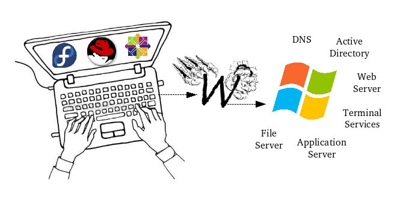
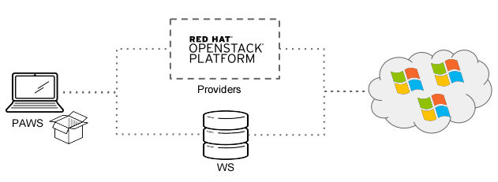

About
-----

Paws is a **Linux based tool** to provision Windows systems and configure Windows
services. Paws easily allows users to build Windows environments with minimal
effort required.

The main goal behind paws is to provide users with a simpler way to test
hybrid environments **Linux and Windows**. While sharing and re-using the
configuration scripts to build the Windows environments.

Paws creates Windows environments using two main components:

1. `Ansible <http://docs.ansible.com/>`_ to provision/teardown and communicate 
via SSH to remote Windows systems provisioned in PAWS providers as example
in an Openstack cloud computing or in a local virtualized environment 
running on Libvirt.

2. Windows configuration scripts wrote in `Windows PowerShell
<https://msdn.microsoft.com/en-us/powershell/mt173057.aspx>`_ language which
perform configuration actions.

*Paws is NOT another tool to provision Windows systems and doesn't intend 
to replace any configuration management tool.*

Paws is a great choice to be used for spinning up Windows systems and
performing a remote desktop connection or to be used by automation/CI
requiring interactions with Windows environments.

We envision paws as the solution to efficiently spin up and configure free
Windows systems leaving hybrid environments no longer an issue for development
or testing purposes.

Paws layers
-----------

Paws is composed of three elements (layers) shown below.

**PAWS:** Command line tool installed on a Linux machine.

**Providers:** The infrastructure that will host the Windows machines. See 
`providers <providers.html>`_ for all providers available at this current
version and it might be expanded further for others such as AWS, GCE etc
It is important to highlight that PAWS uses Ansible `cloud modules
<http://docs.ansible.com/ansible/list_of_cloud_modules.html>`_  to
perform tasks to provision and teardown systems.

**WS:** Is a centralized repository where all PowerShell scripts will live.
PAWS users can use the PowerShells in the repository or they can set PAWS to
use PowerShells from another local repo/folder. This is all configurable by
parameters.

Benefits
--------

1. Create, build and destroy Windows test environments within minutes.

2. Ability to use evaluation Windows images or internal pre-defined QCOW 
   Windows images during trial period.

3. Create fresh environments to validate bugs.

4. Reduce the time spent on support and maintenance of "golden-environments".

5. Use native Windows language (PowerShell) to automate Windows server
   configurations.

6. Easily share paws scripts to run in different test environments (eliminating 
   need to create scripts that already exists).

Examples of usage
------------------

* developers, working in components that interacts with Windows platform can
  use PAWS to provision Windows with all configuration needed to verify their 
  code changes.

* quality engineer, executing any type of tests for products running on hybrid 
  environment **Linux and Windows** can use PAWS to provision the Windows
  environment with pre-defined configuration and ready to start the tests
  execution.

* developers, quality engineers and release engineers, can use PAWS to 
  provison the Windows environment for a release dry-run before go to production.
  With PAWS groups the installation and workflow can be defined managing the
  reproducibility and avoiding left over data reducing risks of a production
  release.  

* devOps, before apply changes in a hybrid environment **Linux and Windows** can
  use PAWS to replicate the Windows environment based on scripts.

----

To get started, navigate to the side bar on the left to see how to
`install <install.html>`_, `use <guide.html>`_ or `contribute <contributing.html>`_
to paws.
