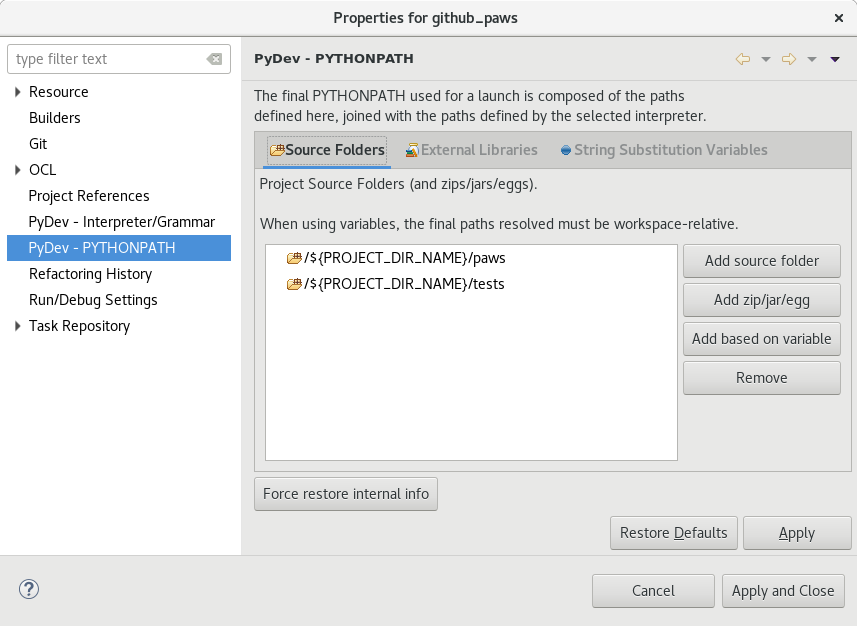

Contributing
=============

There are several ways to contribute with PAWS project and **everyone is welcome**:

* are you python or ansible guy? you can fix bugs or improve the application 
  with new features

* are you Windows guy? you can add new powershell scripts at ws repo
  https://github.com/rhpit/ws

* do you like writing? you can help on documentation.

* and too many others ... testing, reporting issues and new ideas to be
  implemented by developer team

Setup your local environment
-----------------------------

Before you dive into contributing to paws. You will need to setup your
environment so you are able to test your code changes before submitting a code
review.

First enable the repositories on your system that paws requires. You
can find these at the `installation <install.html#dependencies>`_ page.

Next you will need to install packages needed for development. Most of these
packages are dependencies that paws would install when installing by repository.
From a terminal, run the following command based on your operating system.

.. code:: bash

	# Yum package manager
	sudo yum install -y git gcc make rpm-build\
	python-devel python-setuptools python-pip python2-flake8 pylint\
	python-kitchen openssl-devel libffi-devel\
	python-oslo-serialization python-pep8 ansible krb5-workstation

	# Dnf package manager
	sudo dnf install -y git gcc make rpm-build\
	python-devel python-setuptools python-pip python2-flake8 pylint\
	python-kitchen openssl-devel libffi-devel\
	python-oslo-serialization python-pep8 ansible krb5-workstation

Once the development packages have been installed, go ahead and clone the paws
and ws git repos. From a terminal, run the following command.

.. code:: bash

	git clone git@github.com:rhpit/paws.git
	git clone git@github.com:rhpit/ws.git

We recommend you running in a Python virtual environment so from your terminal 
run the following commands.

Create a python virtual environment, activate it and install required libs:

.. code:: bash

	# Switch directories to where you cloned paws git
	$ cd paws

	virtualenv -p /usr/bin/python2.7 venv_paws
	source venv_paws/bin/activate
	pip install -r requirements-dev.txt --upgrade

Build
------

Now that your environment is setup to build paws, lets go through the basics
on building/installing paws from source.

At the root of paws git folder there is a Makefile. From your terminal run the
following command to see available options by paws.

.. code:: bash

	$ make

Here are some of the common ones used by paws developers/contributors.

**Documentation**

From your terminal run the following command to build paws sphinx documentation.

.. code:: bash

	$ make doc

A separated paws-doc folder will be created at same root as paws folder and you
can open the full documentation locally in html format at 
file:///home/user/git/paws-doc/html/index.html

**Build RPM**

From your terminal run the following command to build paws RPM.

.. code:: bash

	$ make rpm

From the console output you will see something similar as below stating where
the RPM was generated. From there you can go ahead and install it.

.. code:: bash

	# Yum package manager
	Wrote: /home/cloud-user/paws/rpmbuild/RPMS/noarch/paws-0.3.4-0.noarch.rpm
	sudo yum install -y /home/cloud-user/paws/rpmbuild/RPMS/noarch/paws-0.3.4-0.noarch.rpm

	# Dnf package manager
	Wrote: /home/fedora/paws/rpmbuild/RPMS/noarch/paws-0.3.4-0.noarch.rpm
	sudo dnf install -y /home/fedora/paws/rpmbuild/RPMS/noarch/paws-0.3.4-0.noarch.rpm

**pip**

For development we recommend installing PAWS by pip as the main reason you
can isolate the application running into a python virtual environment like
example:

.. code:: bash

	virtualenv -p /usr/bin/python2.7 venv
	source venv/bin/activate
	(venv) pip install /home/user/git/paws/dist/paws-0.3.8.tar.gz
	
The install command above is using the local tar.gz built previously by running
**make pip** command. It also could be installed from a pypi-test repo running:

.. code:: bash

	 pip install --index-url https://test.pypi.org/simple/ paws
	 

**Code check**

Before any commit make sure your code changes are following the code standard
of this project running the command:

.. code:: bash

	cd paws
	make codecheck

New release
------------

List of actions that need to be performed for a new release:

1. update paws/version.txt
2. update version and release variables in Makefile and paws.spec
3. make codecheck -- fix if needed
4. commit your changes
5. make doc ( access locally and double check before update upstream doc )
6. make copr-dev
7. make copr-upstream

IDE
----

**Eclipse pydev**

on eclipse and pydev fixing unresolved imports or to link source code to 
correct path double check:

* venv_paws in Python interpreter and project root folder as external libraries

* clean all / build projects 
  
see screenshots:

If you are seeing the error **module (setup) is missing interpreter line** when
running PAWS from your Eclipse IDE maybe for debug purpose you need to change
the path for **Working directory** to anything else out of your source code.

	