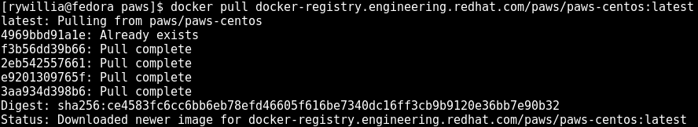
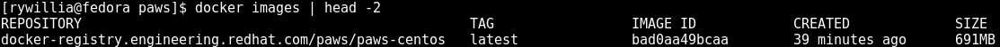
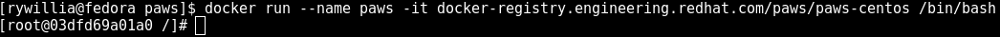
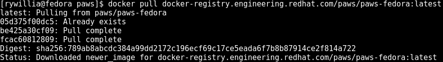
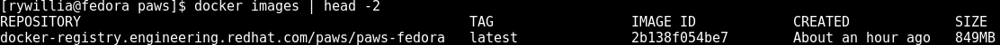
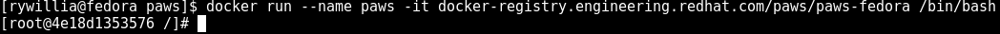

Installation
============

PAWS is only supported in Linux systems and currently can be installed as 
regular application based on RPM or container. 

Support matrix
--------------

.. csv-table::
	:header: "Operating System", "Version", "Application", "Container"
	:widths: 100, 75, 70, 70

	"`CentOS <http://www.centos.org>`_", "7.2, 7.3, 7.4", "Yes", "Yes"
	"`Fedora <http://www.fedoraproject.org>`_", "24, 25, 26", "Yes", "Yes"
	"`Red Hat Enterprise Linux <https://www.redhat.com/en/technologies/linux-platforms>`_", "7.2, 7.3, 7.4", "Yes", "No"

Application
-----------

PAWS is distributed as RPM package compatible with YUM and DNF package manager systems and the repos are available in Fedora Copr project 
https://copr.fedorainfracloud.org/coprs/eduardocerqueira/paws/
and below follow the steps to install PAWS for each of supported platform: 

CentOS
++++++

.. code-block:: bash

	sudo yum install -y centos-release-openstack-liberty
	sudo yum install -y https://dl.fedoraproject.org/pub/epel/epel-release-latest-7.noarch.rpm
	sudo curl -o /etc/yum.repos.d/paws.repo https://copr.fedorainfracloud.org/coprs/eduardocerqueira/paws/repo/epel-7/eduardocerqueira-paws-epel-7.repo
	sudo yum install -y paws

Fedora
++++++

Replace version at repo url depending of your Fedora version. 

.. code-block:: bash

	sudo curl -o /etc/yum.repos.d/paws.repo https://copr.fedorainfracloud.org/coprs/eduardocerqueira/paws/repo/fedora-24/eduardocerqueira-paws-fedora-24.repo
	sudo dnf install -y paws

Red Hat Enterprise Linux
++++++++++++++++++++++++

.. code-block:: bash

	# Subscribe to Red Hat Network (https://mojo.redhat.com/docs/DOC-97363)
	sudo subscription-manager register
	sudo subscription-manager attach
	sudo subscription-manager repos --enable rhel-7-<variant>-rpms
	sudo subscription-manager repos --enable rhel-7-<variant>-optional-rpms
	sudo subscription-manager repos --enable rhel-7-<variant>-extras-rpms
	sudo subscription-manager repos --enable rhel-7-<variant>-openstack-8-tools-rpms
	sudo yum install -y https://dl.fedoraproject.org/pub/epel/epel-release-latest-7.noarch.rpm
	sudo curl -o /etc/yum.repos.d/paws.repo http://download-node-02.eng.bos.redhat.com/rcm-guest/pit/paws/latest/x86_64/os/paws.repo
	sudo yum install -y paws

.. attention::

	Ansible requires two additional python packages to be installed in order
	to communicate with Windows systems.

	**pywinrm**: This package is used for Windows remote management.
	At this time there is no RPM available.

	*https://pypi.python.org/pypi/pywinrm*

	**shade**: This package is required by Ansible to
	provision/teardown resources in a cloud infrastructure.

	*https://pypi.python.org/pypi/shade*
	*http://docs.openstack.org/infra/shade/*
	*http://docs.ansible.com/ansible/list_of_cloud_modules.html#openstack*

Container
---------

To use paws in a container, you will need to have docker installed and running
on your system. Please see the following link for details to setup your system
with docker: https://docs.docker.com/engine/installation/

CentOS
++++++

Pull down the paws-centos image:

.. code-block:: bash

	$ docker pull docker-registry.engineering.redhat.com/paws/paws-centos:latest

You can view the image by the following command:

.. code-block:: bash

	$ docker images

Next start the container:

.. code-block:: bash

	$ docker run --name paws -it docker-registry.engineering.redhat.com/paws/paws-centos /bin/bash

This will run the /bin/bash command inside a new container based on the paws-fedora
image. We gave the -it option to allow us to have a terminal prompt into the
container. This will allow us to run paws commands inside.

You now have a container running with paws fully installed and ready to
use!

Fedora
++++++

Pull down the paws-fedora image:

.. code-block:: bash

	$ docker pull docker-registry.engineering.redhat.com/paws/paws-fedora:latest

You can view the image by the following command:

.. code-block:: bash

	$ docker images

Next start the container:

.. code-block:: bash

	$ docker run --name paws -it docker-registry.engineering.redhat.com/paws/paws-fedora /bin/bash

This will run the /bin/bash command inside a new container based on the paws-fedora
image. We gave the -it option to allow us to have a terminal prompt into the
container. This will allow us to run paws commands inside.

You now have a container running with paws fully installed and ready to
use!

Red Hat Enterprise Linux
++++++++++++++++++++++++

No paws image is available for Red Hat Enterprise Linux at the moment.

----

You are now ready to begin using paws! To get started please navigate to the
side bar on the left to see the `getting started <guide.html>`_
guide.
