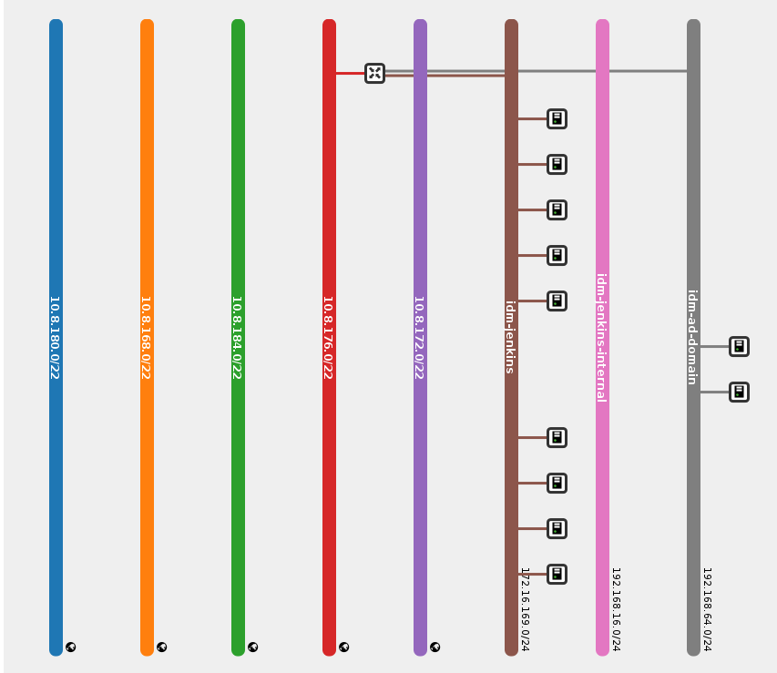

Providers
==========

The definition of **provider** for PAWS is the location where the Windows will
be provisioned and managed by PAWS. it is the list of providers supported:

* `Openstack provider <providers.html#openstack>`_

* `Libvirt provider <providers.html#libvirt>`_

Openstack
---------

http://www.openstack.org

PAWS is integrated with Openstack and able to provision, configure and manage
Windows virtual machines running on public or private clouds.

Path: /home/$USER/ws/credentials.yaml

.. code-block:: yaml

   credentials:
      - provider: openstack
        os_auth_url: http://<hostname>:<port>/<api_version>
        os_username: <username>
        os_password: <password>
        os_project_name: <project_name>
        os_region: <region>

+------------------+------------------------+------------------------+
|    Field name    |      Description       |         Value          |
+==================+========================+========================+
| provider         | name of provider where |   openstack, libvirt   |
|                  | your Windows system    |                        |
|                  | will live              |                        |
+------------------+------------------------+------------------------+
| os_auth_url      | OpenStack URL/port for | HTTP URL see in file   |
|                  | authentication         | above to use OSP7      |
+------------------+------------------------+------------------------+
| os_username      | Username to login to   | tenant username        |
|                  | OpenStack tenant       |                        |
+------------------+------------------------+------------------------+
| os_password      | Password to login to   | tenant password        |
|                  | OpenStack tenant       |                        |
+------------------+------------------------+------------------------+
| os_project_name  | Name of the OpenStack  | tenant or project      |
|                  | tenant or project      |                        |
+------------------+------------------------+------------------------+

Path: /home/$USER/ws/resources.yaml

.. code-block::  yaml

   resources:
      - name: windows_server_01
        provider: openstack
        count: 1
        image: win-2016-serverstandard-x86_64-released
        flavor: m1.xlarge
        network: 192.168.1.0
        keypair: <keypair>
        ssh_private_key: /home/$USER/.ssh/<private_key>
        administrator_password: my_password@2018

*PS: resources accepts multiple resources definition.*

+------------------------+-----------------------------------+-------------+
|    Field name          |      Description                  |  Required   |
+========================+===================================+=============+
| name                   | The name that will be given when  |      Yes    |
|                        | the instance is provisioned       |             |
|                        | (Openstack sets this as the       |             |
|                        | instance name). When count > 1    |             |
|                        | during provisioning the instance  |             |
|                        | name will be automatically        |             |
|                        | appended with sequential numbers. |             |
+------------------------+-----------------------------------+-------------+
| provider               | provider name to use              |      Yes    |
+------------------------+-----------------------------------+-------------+
| count                  | The number of identical resources |      Yes    |
|                        | to create. This count only applies|             |
|                        | to each specific resource section.|             |
|                        | It does not apply to all resources|             |
|                        | in the file.                      |             |
+------------------------+-----------------------------------+-------------+
| image                  | The name of the image to be used  |      Yes    |
|                        | to create the instance. The       |             |
|                        | Windows image should exist and    |             |
|                        | your provider account must have   |             |
|                        | permission to use it.             |             |
|                        | *Check Openstack in FAQ to see*   |             |
|                        | *how you can get the full list of*|             |
|                        | *current Windows images in your*  |             |
|                        | *Openstack provider*              |             |
+------------------------+-----------------------------------+-------------+
| flavor                 | The flavor name or ID which should|      Yes    |
|                        | be used when creating the new     |             |
|                        | instance                          |             |
|                        | *Check Openstack FAQ to see how*  |             |
|                        | *you can get the full list of*    |             |
|                        | *current Windows flavors in your* |             |
|                        | *Openstack provider*              |             |
+------------------------+-----------------------------------+-------------+
| network                | The name or ID of a network to    |      Yes    |
|                        | attach this instance to. This     |             |
|                        | network will provide the floating |             |
|                        | IP to your instance. You will want|             |
|                        | to supply the external network    |             |
|                        | name as your network if it has a  |             |
|                        | router connecting it to an        |             |
|                        | internal network.                 |             |
+------------------------+-----------------------------------+-------------+
| keypair                | The key pair name to be used when |      Yes    |
|                        | creating an instance              |             |
+------------------------+-----------------------------------+-------------+
| ssh_private_key        | Absolute path from your host      |      Yes    |
|                        | machine to the SSH private key to |             |
|                        | login to system via SSH           |             |
+------------------------+-----------------------------------+-------------+
| administrator_password | The administrator password to set |      No     |
|                        | on the Windows system after       |             |
|                        | provisioning has finished.        |             |
+------------------------+-----------------------------------+-------------+
| snapshot               | Take a snapshot for a given       |      No     |
|                        | resource.                         |             |
+------------------------+-----------------------------------+-------------+

.. note::

   **-snapshot:** Take a snapshot for a given resource.

   .. code-block:: yaml

      # example 1: create snapshot and clean previous snapshots for the vm
      resources:
         - name: MY_WINDOWS_VM
           snapshot:
             create: True
             clean: True

      # example 2: do not create snapshot and only clean previous snapshots
      for the vm:
      resources:
         - name: MY_WINDOWS_VM
           snapshot:
             create: False
             clean: True

      # example 3: create snapshot, override default settings for attempts and
      # delay between attempts when checking if snapshot was created
      # default attempts is 30 and default delay is 20 seconds
      resources:
         - name: MY_WINDOWS_VM
           snapshot:
             create: True
             attempts: 60
             delay: 30

single network
^^^^^^^^^^^^^^

An Openstack tenant which has a single network connected to a public network.

You can find your Openstacks network topology by accessing the following link
with your credentials http://<hostname>/dashboard/project/network_topology/

Example resources.yaml:

.. code-block::  yaml

   resources:
      - name: windows_server_01
        provider: openstack
        count: 1
        image: win-2016-serverstandard-x86_64-released
        flavor: m1.xlarge
        network: 10.8.172.0/22
        keypair: <keypair>
        ssh_private_key: /home/$USER/.ssh/<private_key>
        administrator_password: my_password@2018

.. note::

   Looking at the network topology image above. You will see a router is
   connected to the 10.8.172.0/22 external network. This external network
   can be used as the network name in your resources.yaml.

multiple networks
^^^^^^^^^^^^^^^^^

A Openstack tenant which has multiple networks connected to a public network.

You can find your Openstacks network topology by accessing the following link
with your credentials http://<hostname>/dashboard/project/network_topology/

Example resources.yaml:

.. code-block::  yaml

   resources:
      - name: windows_server_01
        provider: openstack
        count: 1
        image: win-2016-serverstandard-x86_64-released
        flavor: m1.xlarge
        network: <network_name>
        floating_ip_pools: 10.8.172.0/22
        network: 10.8.172.0/22
        keypair: <keypair>
        ssh_private_key: /home/$USER/.ssh/<private_key>
        administrator_password: my_password@2018

In this example we want to highlight on two keys that will need to be set
correctly if your Openstack tenant has multiple networks connected to the
same public network. For information about all other keys, please reference
to the descriptions above.

.. note::
   (REQUIRED)

   **- network:** The network name should define which internal network you
   want the instance to be created on. It should not be the name of the
   external network to attach too.

   *E.g. Looking at the network topology image above, we will want to
   give the name of one of the internal networks to use. In this case we
   will give idm-ad-domain.*

   **- floating_ip_pools:** The name of the external network to use to create
   the floating IP for the provisioned instance.

   *E.g. Looking at the network topology image above, we will want to give
   the floating_ip_pools a value of 10.8.176.0/22. Since this is the
   external network connected to one of the internal networks in the
   image.*

.. attention::

   If your Openstack has multiple networks connected to the same external
   network, it is REQUIRED that you set the floating_ipPools key. This key
   tells paws which external network to use to create the floating IP.

   Setting both network and floating_ip_pools for a single network connected
   to an external network will work as well.

----

Libvirt
-------

http://www.libvirt.org

PAWS is integrated with Libvirt and able to provision, configure and manage
Windows virtual machines running locally.

`PAWS Image Service <https://github.com/rhpit/paws-imgsrv>`_ is an internal
repository for Windows QCOW images. If you have your own QCOW Windows images
ready to run on Libvirt you only need to configure your paws files.

To run PAWS with libvirt you need to create **credentials.yaml** and
**resources.yaml** see below details for these two files and a sample.

To configure your machine to run PAWS with libvirt follow
the section `Running Windows on VM <libvirt.html>`_

path: /home/$USER/ws/credentials.yaml

.. code-block:: yaml

   credentials:
      - provider: libvirt
        qemu_instance: qemu:///system
        imgsrv_url: http://imgsrv.url.com

+------------------+------------------------+----------------------------------+
|    Field name    |      Description       |         Value                    |
+==================+========================+==================================+
| provider         | name of provider where |   openstack, libvirt             |
|                  | your Windows system    |                                  |
|                  | will live              |                                  |
+------------------+------------------------+----------------------------------+
| qemu_instance    | specify the instance   | system, session                  |
|                  | for QEMU driver to use | for more information             |
|                  |                        | https://libvirt.org/drvqemu.html |
+------------------+------------------------+----------------------------------+
| imgsrv_url       | URL to retrieve the    | http://imgsrv.url.com            |
|                  | pre-configured Windows | or for dev purpose, if running   |
|                  | image for Libvirt      | IMGSRV locally you can use       |
|                  |                        | http://127.0.0.1:5000            |
+------------------+------------------------+----------------------------------+

path: /home/$USER/ws/resources.yaml

.. code-block:: yaml

   resources:
      - name: windows_server_01
        provider: libvirt
        memory: 4000
        vcpu: 1
        disk_source: /home/$USER/Downloads/<WINDOWS_QCOW>
        win_username: Administrator
        win_password: my_password@2018

+------------------------+-----------------------------------+-------------+
|    Field name          |      Description                  |  Required   |
+========================+===================================+=============+
| name                   | The name that will be given when  |      Yes    |
|                        | the instance is provisioned       |             |
+------------------------+-----------------------------------+-------------+
| provider               | provider name to use              |      Yes    |
+------------------------+-----------------------------------+-------------+
| memory                 | The amount of memory you want to  |      Yes    |
|                        | set for the new virtual machine   |             |
|                        | that will be provisioned          |             |
|                        | *must be in MB*                   |             |
+------------------------+-----------------------------------+-------------+
| vcpu                   | The number of virtual CPU you want|      Yes    |
|                        | to allocate for the new virtual   |             |
|                        | machine                           |             |
+------------------------+-----------------------------------+-------------+
| disk_source            | The location in your local machine|      Yes    |
|                        | where the pre-configured Windows  |             |
|                        | image will be saved. This file is |             |
|                        | the storage drive for your virtual|             |
|                        | machine                           |             |
+------------------------+-----------------------------------+-------------+
| win_username           | the username pre-configured in the|      Yes    |
|                        | Windows image. You get this from  |             |
|                        | IMGSRV                            |             |
+------------------------+-----------------------------------+-------------+
| win_password           | the password pre-configured in the|      Yes    |
|                        | Windows image. You get this from  |             |
|                        | IMGSRV                            |             |
+------------------------+-----------------------------------+-------------+

